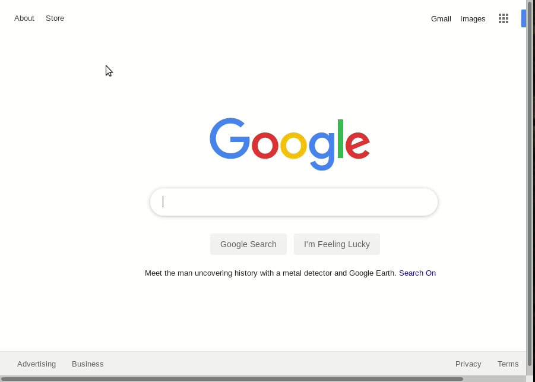

```{r setup, include=FALSE}
options(htmltools.dir.version = FALSE)
```

class: inverse, center, middle

# **What we've been up to**

---

# 



---

# `eddi`: R package for the NOAA Evaporative Demand Drought Index

```{r eval=TRUE, tidy=FALSE}
# install.packages('eddi')
library(eddi)

eddi_data <- get_eddi(date = "2019-05-25", timescale = "1 month")
eddi_data
```


.footnote[
[1] http://www.earthdatascience.org/eddi/

[2] Also see http://www.earthdatascience.org/leri/
]

---

class: inverse, center, middle

# **What if all of our science was open?**

---


# **Usable** data 

# **Runnable** models

# **Reproducible** papers

---

class: inverse, center, middle

# **Help us help you!**

---

# What can we help you build?

## - data products
## - models
## - workflows
## - manuscripts

